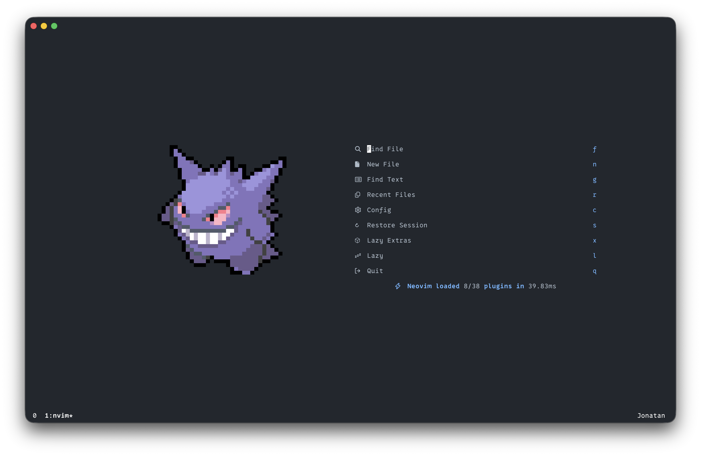
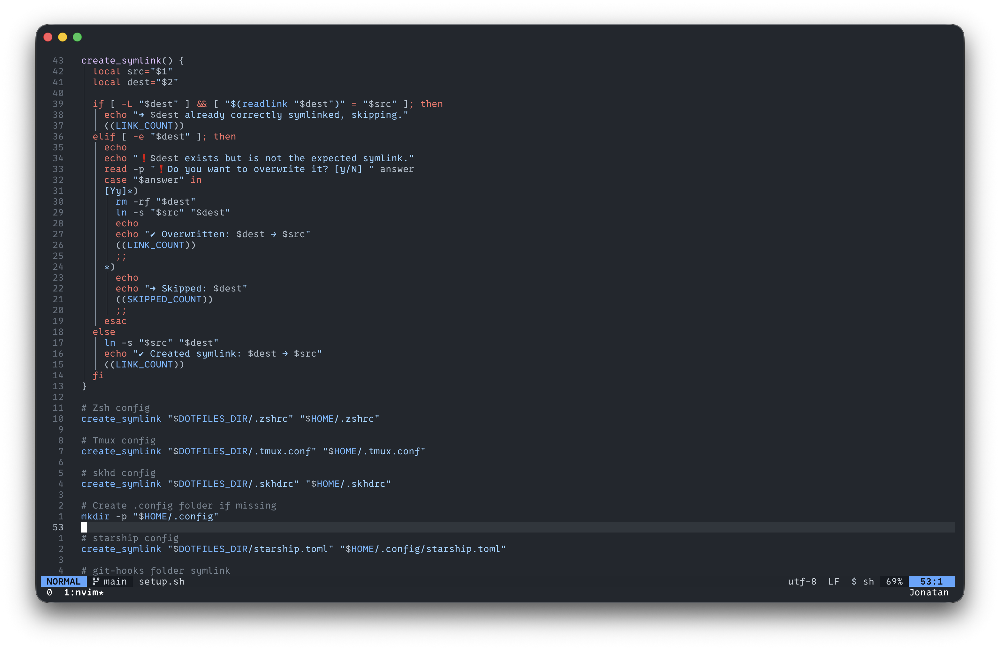

# 💤 LazyVim 0.1

My personal, customized setup of [LazyVim](https://github.com/LazyVim/LazyVim).
> Based on the official [LazyVim starter template](https://github.com/LazyVim/LazyVim).  
> Refer to the [installation guide](https://lazyvim.github.io/installation) to get started.

#### 🔧 My Additions
- **Harpoon** – Quick file navigation and bookmarking  
- **Snacks.nvim** – Visual enhancements and quality-of-life utilities  
- **GitHub Dark Theme** – Sleek and comfortable dark color scheme  
- **Tmux Navigator** – Seamless navigation between Neovim and tmux panes  
- **Blink.nvim** – Modern completion engine (replaces or complements nvim-cmp)

## 🧩 Screenshots

